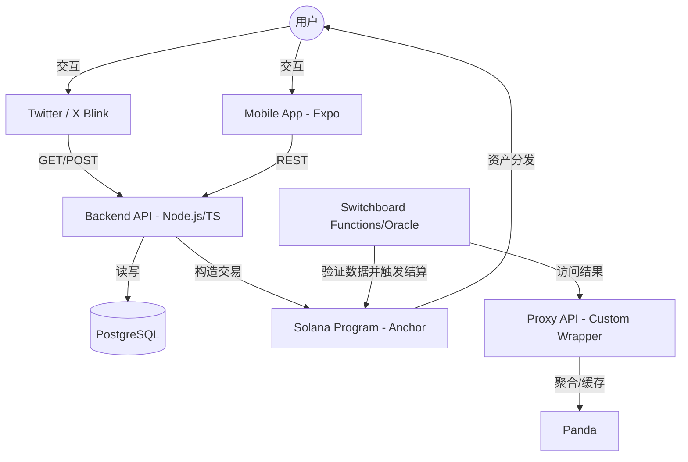

# 🏗️ 技术架构文档: BlinkBet

**版本：** v1.0
**日期：** 2026-04-21
**项目背景：** 2026 Solana Hackathon

---

## 1. 总体架构图

项目采用典型的 Web3 DApp 架构，结合了 Solana 特有的 Actions/Blinks 协议实现社交直连。

---

## 2. 核心组件说明

### 2.1 智能合约 (Solana Program)
*   **开发框架：** Anchor Framework (Rust)
*   **核心状态 (Accounts)：**
    *   `GlobalConfig`: 存储协议管理员地址、手续费比例等。
    *   `MatchPool (PDA)`: 为每场比赛创建的独立账户，存储总奖池资金、胜负选项的下注统计。
    *   `UserBet (PDA)`: 记录用户在特定比赛中的下注金额和选项。
*   **核心指令 (Instructions)：**
    *   `initialize_match`: 后端管理员创建比赛池。
    *   `place_bet`: 用户存入 SOL/USDC 进行下注。
    *   `settle_match`: 比赛结束后，后端多签触发，根据结果按比例分账。

### 2.2 后端服务 (Backend & API)
*   **技术栈：** Node.js + TypeScript + InversifyJS (DI)
*   **Actions/Blinks 实现：**
    *   符合 [Solana Actions Spec](https://github.com/solana-labs/actions)。
    *   动态图片渲染：利用 `canvas` 或服务端组件实时生成带对阵/赔率信息的预览图。
*   **数据库：** PostgreSQL (Prisma ORM)
    *   同步比赛元数据（Team Name, Logo URI）以提高前端响应速度。

### 2.3 预言机与数据代理 (Oracle & Data Proxy)
*   **Switchboard Functions (Oracle)：**
    *   作为链上与链下的桥梁，负责最终的结算触发。
    *   通过自定义的 Rust 容器，定期请求 **Proxy API**。
    *   在 TEE 环境中运行请求，确保数据获取过程的去中心化验证，并自动调用合约的 `settle_match` 接口。
*   **Proxy API (Custom Wrapper)：**
    *   **用途**：对 `PandaScore API` 进行二次封装。
    *   **核心功能**：
        1.  **缓存层**：由于 PandaScore 有调用频率限制（Rate Limit），Proxy API 缓存赛事结果，避免 Switchboard 的并发请求直接打崩原站接口。
        2.  **数据简化**：将复杂的 PandaScore JSON 结构简化为结算所需的最小数据格式（如 `{"match_id": 123, "winner_id": 456, "status": "finished"}`）。
        3.  **鉴权保护**：对外隐藏 PandaScore 的 API Key，仅允许 Switchboard 节点的 IP 或特定鉴权头访问。

### 2.4 移动端应用 (Mobile App)
*   **技术栈：** Expo (React Native) + Expo Router
*   **功能模块：**
    *   **Dashboard**: 展现即将开始的赛事列表。
    *   **Blink Renderer**: 内置渲染器，支持在 App 内部像在 Twitter 一样快速预览和操作其他 Blink。
    *   **Wallet**: 集成钱包适配器（Mobile Wallet Adapter）。

---

## 3. 数据流设计

### 3.1 下注流程 (Betting Flow)
1.  用户点击 Blink 上的按钮 (e.g., "Bet on T1")。
2.  Blink 向后端发起 POST 请求。
3.  后端根据当前比赛 PDA 的状态，利用 `@solana/web3.js` 构造 `place_bet` 指令的交易对象。
4.  交易返回给 Blink，用户在 Phantom/Backpack 确认签名。
5.  交易在 Solana 链上执行成功。

### 3.2 结算流程 (Settlement Flow)
1.  `Worker` 发现比赛 `T1 vs Gen.G` 已结束，结果为 `T1` 胜。
2.  `Worker` 从 `PandaScore` 获取结果证明。
3.  `Worker` 使用后端 Admin 签名发起 `settle_match` 交易。
4.  合约根据 `MatchPool` 统计的比例，自动将池内资金分发给所有预测 `T1` 的用户。

---

## 4. 关键技术亮点

*   **Atomic Settlement (原子结算)：** 资金分发逻辑完全由链上合约执行，后端仅负责提供权威结果，确保资金安全。
*   **State Compression (可选)：** 若用户量极大，利用 Solana 状态压缩降低用户 `UserBet` 账户的租金成本。
*   **Mobile-First Blinks：** 针对 2026 年移动端对 Actions 的支持，优化 App 端交互链路。
