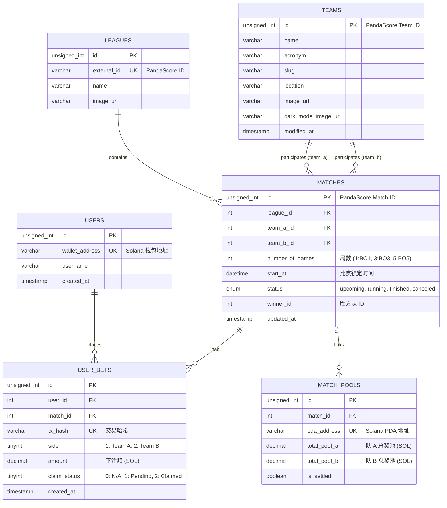

# 🗄️ 数据库设计文档: BlinkBet

**版本：** v1.0
**数据库类型：** MySQL 8.0+
**设计目标：** 支持赛事元数据存储、用户预测记录展示、以及与 Solana 链上合约状态的快速同步。

---

## 1. 实体关系图 (ERD)

---

## 2. 表结构详细说明

### 2.1 `users` (用户表)
存储基本用户信息及钱包关联。
| 字段名 | 类型 | 约束 | 说明 |
| :--- | :--- | :--- | :--- |
| `id` | INT UNSIGNED | PK, AUTO_INC | 用户内部 ID |
| `wallet_address` | VARCHAR(44) | UNIQUE, NOT NULL | Solana 公钥 |
| `created_at` | TIMESTAMP | DEFAULT NOW() | 注册时间 |

### 2.2 `leagues` (联赛表)
存储赛事所属联赛的元数据。
| 字段名 | 类型 | 约束 | 说明 |
| :--- | :--- | :--- | :--- |
| `id` | INT UNSIGNED | PK | PandaScore League ID (如 294) |
| `slug` | VARCHAR(100) | UNIQUE | 联赛标识 (如 league-of-legends-lpl-...) |
| `name` | VARCHAR(100) | NOT NULL | 联赛全名 (如 Split 2 2026) |
| `season` | VARCHAR(50) | - | 赛季 (如 Split 2) |
| `year` | INT | - | 年度 (如 2026) |
| `image_url` | VARCHAR(255) | - | 联赛 Logo URL |

### 2.3 `teams` (战队表)
存储参与赛事的战队元数据。
| 字段名 | 类型 | 约束 | 说明 |
| :--- | :--- | :--- | :--- |
| `id` | INT UNSIGNED | PK | PandaScore Team ID (如 129972) |
| `name` | VARCHAR(100) | NOT NULL | 战队全称 (如 Weibo Gaming) |
| `acronym` | VARCHAR(20) | - | 战队简称 (如 WB) |
| `slug` | VARCHAR(100) | UNIQUE | 战队标识 (如 weibo-gaming-...) |
| `location` | VARCHAR(10) | - | 所在地 (如 CN) |
| `image_url` | VARCHAR(255) | - | 常用 Logo |
| `dark_mode_image_url` | VARCHAR(255) | - | 深色模式 Logo |
| `modified_at` | DATETIME | - | 外部数据更新时间 |

### 2.4 `matches` (赛事表)
缓存来自 PandaScore 的赛事元数据，减少前端对外部 API 的直接请求。
| 字段名 | 类型 | 约束 | 说明 |
| :--- | :--- | :--- | :--- |
| `id` | INT UNSIGNED | PK | PandaScore 的赛事 ID |
| `league_id` | INT UNSIGNED | FK | 关联 leagues.id |
| `team_a_id` | INT UNSIGNED | FK | 关联 teams.id |
| `number_of_games` | INT | DEFAULT 1 | 局数 (1:BO1, 3:BO3, 5:BO5) |
| `team_b_id` | INT UNSIGNED | FK | 关联 teams.id |
| `start_at` | DATETIME | NOT NULL | 用于在 App 端判断下注截止 |
| `status` | ENUM | 'upcoming'... | 赛事状态 |
| `winner_id` | INT | NULL | 胜方 team_id |

### 2.5 `match_pools` (奖池同步表)
记录合约中 `MatchPool` PDA 的实时汇总数据，加速 Dashboard 渲染。
| 字段名 | 类型 | 约束 | 说明 |
| :--- | :--- | :--- | :--- |
| `match_id` | INT UNSIGNED | FK, UNIQUE | 关联 matches.id |
| `pda_address` | VARCHAR(44) | NOT NULL | 链上合约奖池地址 |
| `total_pool_a` | DECIMAL(20,9) | DEFAULT 0 | 队 A 累计 SOL (Lamports 换算) |
| `total_pool_b` | DECIMAL(20,9) | DEFAULT 0 | 队 B 累计 SOL |
| `is_settled` | BOOLEAN | DEFAULT FALSE | 合约是否已调用 settle |

### 2.4 `user_bets` (下注记录表)
记录用户的历史行为，支持移动端 "My Bets" 页面。
| 字段名 | 类型 | 约束 | 说明 |
| :--- | :--- | :--- | :--- |
| `id` | INT UNSIGNED | PK | 内部 ID |
| `user_id` | INT UNSIGNED | FK | 关联 users.id |
| `match_id` | INT UNSIGNED | FK | 关联 matches.id |
| `tx_hash` | VARCHAR(88) | UNIQUE | 链上交易 Signature |
| `side` | TINYINT | 1/2 | 下注方向 |
| `amount` | DECIMAL(20,9) | NOT NULL | 下注 SOL 数量 |
| `claim_status` | TINYINT | 0, 1, 2 | 0:未开奖, 1:待领, 2:已领 |

---

## 3. 对接方案 A (Switchboard) 的设计考虑

为了配合 **方案 A (全自动结算)**，数据库设计包含以下关键点：
1. **状态索引**：后端 Worker 会根据 `matches.status = 'upcoming'` 定时检查外部 API。
2. **PDA 反查**：当 Switchboard 成功在链上执行 `settle_match` 后，后端通过监听合约 Event（见设计文档第 3 节），更新 `match_pools.is_settled` 为 `1`。
3. **前端优化**：App 端展示的“赔率”将由 `total_pool_a / total_pool_b` 实时间接计算得出。

---

## 4. 索引优化 (Indexes)
- `idx_matches_start`: 在 `start_at` 上建索引，用于获取“即将开始”的列表。
- `idx_user_match`: 在 `(user_id, match_id)` 上建复合索引，加速查询用户在特定比赛的投注。
- `idx_status`: 在 `matches.status` 上建索引，方便后台 Worker 扫描需要结算的比赛。
