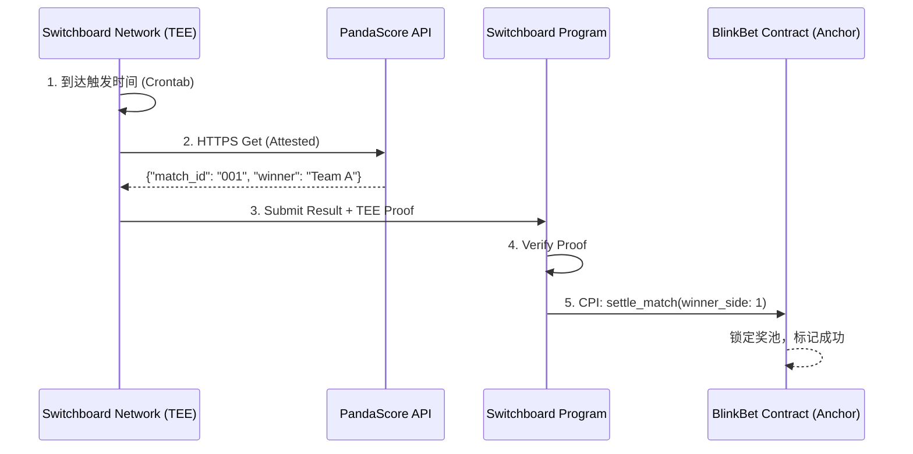

# 🦀 智能合约设计文档: BlinkBet (Solana/Anchor)

**项目名称：** BlinkBet  
**框架：** Anchor 0.30+ / Rust  
**开发目标：** 实现去中心化的赛事预测奖池，支持自动化结算与透明的资金分配。

---

## 1. 核心业务逻辑 (Business Logic)
合约负责管理预测奖池的完整生命周期：
1. **初始化 (Initialize)**: 后端管理员根据赛事 ID 创建一个独立的 `MatchPool`。
2. **下注 (Place Bet)**: 用户向奖池存入 SOL，合约记录其选择的队伍和金额。
3. **锁定 (Lock)**: 比赛开始后，奖池停止接收新的预测（通过前端/后端逻辑或链上时间戳）。
4. **结算 (Settle)**: 比赛结束后，预言机/后端提交结果，合约根据池中胜负比例，自动将奖金按权重分发给胜方用户。

---

## 2. 账户结构 (Data Structure)

### 2.1 GlobalConfig (PDA)
存储协议全局参数。
* Seed: `["config"]`
* 字段：
    * `admin`: `Pubkey` (有权创建赛事的地址)。
    * `fee_recipient`: `Pubkey` (手续费收取地址)。
    * `fee_bps`: `u16` (手续费比例，例如 500 代表 5%)。

### 2.2 MatchPool (PDA)
每一场比赛动态创建一个账户。
* Seed: `["match", match_id]`
* 字段：
    * `match_id`: `String` (外部数据源如 PandaScore 的 ID)。
    * `start_time`: `i64` (锁定预测的时间戳)。
    * `total_pool_a`: `u64` (支持队伍 A 的总金额)。
    * `total_pool_b`: `u64` (支持队伍 B 的总金额)。
    * `winner`: `u8` (0: 未结算, 1: A 胜, 2: B 胜, 3: 平局/取消)。
    * `is_settled`: `bool` (是否已完成资金分发)。
    * `bump`: `u8`。

### 2.3 UserBet (PDA)
记录单个用户的下注信息，用于结算时提取资金（可选，也可通过 Event/Indexer 线下计算后由合约统一分发）。
* Seed: `["bet", match_id, user_pubkey]`
* 字段：
    * `amount`: `u64` (投入金额)。
    * `side`: `u8` (1: 选 A, 2: 选 B)。
    * `is_claimed`: `bool` (是否已领取奖金)。

---
## 3. 事件定义 (Events)

为了方便后端进行数据索引 (Indexing) 和实时状态同步，合约会同步抛出以下事件。

### 3.1 `MatchInitialized`
*   触发点：`initialize_match`
*   字段：
    *   `match_id`: `String` (赛事 ID)
    *   `start_time`: `i64` (锁定时间)
    *   `pool_pda`: `Pubkey` (奖池账户地址)

### 3.2 `BetPlaced`
*   触发点：`place_bet`
*   字段：
    *   `match_id`: `String`
    *   `user`: `Pubkey` (下注用户)
    *   `side`: `u8` (选择方向: 1 或 2)
    *   `amount`: `u64` (下注数量)

### 3.3 `MatchSettled`
*   触发点：`settle_match`
*   字段：
    *   `match_id`: `String`
    *   `winner_side`: `u8` (最终胜方)
    *   `total_pool_a`: `u64`
    *   `total_pool_b`: `u64`

### 3.4 `PrizeClaimed`
*   触发点：`claim_prize`
*   字段：
    *   `match_id`: `String`
    *   `user`: `Pubkey`
    *   `amount`: `u64` (领取到的总奖金)

---
## 4. 指令集 (Instructions)

### 4.1 `initialize_match`
* **权限：** 仅限 `GlobalConfig.admin`。
* **参数：** `match_id`, `start_time`。
* **逻辑：** 创建 `MatchPool` 账户，初始化总金额为 0。

### 4.2 `place_bet`
* **权限：** 任何用户。
* **参数：** `match_id`, `amount`, `side`。
* **逻辑：**
    1. 校验当前时间 < `start_time`。
    2. 用户转账 SOL 到 `MatchPool` PDA 账户（作为托管）。
    3. 更新 `MatchPool` 对应方向的 `total_pool`。
    4. 创建或更新 `UserBet` 账户。

### 4.3 `settle_match`
* **权限：** 仅限 `admin` 或受信任的 `oracle` 地址。
* **参数：** `winner_side` (1 或 2)。
* **逻辑：** 设定 `MatchPool.winner` 和 `is_settled`。

### 4.4 `claim_prize`
* **权限：** 预测正确的用户。
* **逻辑：**
    1. 计算赔率：`Winner_Pool / Total_Pool`。
    2. 计算用户奖金：`(User_Bet / Winner_Pool) * Total_Pool * (1 - Fee)`。
    3. 从 `MatchPool` 转账 SOL 到用户账户。
    4. 标记 `UserBet.is_claimed = true`。

---

## 5. 结算方案实现

考虑到黑客松开发效率与去中心化程度的平衡，本项目设计了两种方案。

### 5.1 方案 A (Switchboard Functions 全自动去中心化结算)

**方案 A 是本项目目前的核心实施方案**。它利用 Switchboard 的 **TEE (可信执行环境)** 容器技术，实现了完全去中心化的赛事结果上链与自动结算。

#### 5.1.1 核心流程 (The TEE Lifecycle)

1.  **定期触发 (Schedule)**：Switchboard 网络根据预设的 Crontab（如每 10 分钟一次）在分布式 TEE 节点中启动本项目的专用 Rust 脚本。
2.  **安全抓取 (Attested Fetch)**：
    *   容器内部发起 HTTPS 请求访问特定的比赛结果数据源。
    *   利用 TEE 的远程度量 (Remote Attestation) 机制，确保该请求是在未被篡改的硬件隔离环境中发出的。
3.  **链上证明生成 (Enclave Proof)**：
    *   脚本根据比赛结果（winner_side）生成一份证明。
    *   Switchboard 合约校验该证明，确认数据来源真实无误且符合预设逻辑。
4.  **自动执行结算 (Autonomous Settlement)**：
    *   一旦证明验证通过，Switchboard 协议将直接从链上发起 **CPI (Cross-Program Invocation)** 调用 BlinkBet 合约的 `settle_match` 指令。
    *   `MatchPool` 状态原子化更新，正式进入申领阶段。

#### 5.1.2 架构说明

#### 5.1.3 方案优势
*   **0 管理员参与**：完全消除单点故障风险，开发者无法手动干扰结算结果。
*   **硬件安全级验证**：通过 Intel SGX 等硬件技术保证结果抓取的真实性，而非依靠后端服务的诚实度。
*   **极速响应**：比赛结束后几分钟内，全球用户即可在链上看到结果并开始 Claim。

### 5.2 方案 B (管理员节点触发 - 已废弃/备选)

本项目当前已全面转向 **方案 A**，方案 B 仅作为开发初期的调试验证手段，不再在生产环境或黑客松演示中使用。

---

## 6. 关键技术亮点 (Technical Highlights)

- **Blink 友好型设计：** `place_bet` 的指令针对 Solana Actions 进行了优化，减少了账户依赖，确保在 Blink 的小交易限制内能顺利完成。
- **动态赔率：** 基于 Pari-Mutuel（定池赔率）模型，预测完成后才会锁定最终收益率，保证了协议永远不会出现超支。
- **无许可申领：** 采用用户主动 `claim` 模式，避免了后端因 GAS 费过高而在比赛结束后无法一次性给成千上万用户转账的问题。

---

## 7. 安全考虑 (Security)

1. **时间重放攻击：** 合约内强制校验时间戳，确保比赛开始后无法再注入资金。
2. **多签结算：** 未来可引入 `Switchboard` 预言机或多签授权地址通过 `settle_match`，防止单点故障。
3. **租金回收：** 在用户 `claim` 之后，可以通过关闭 `UserBet` 账户将租金返还给用户。
